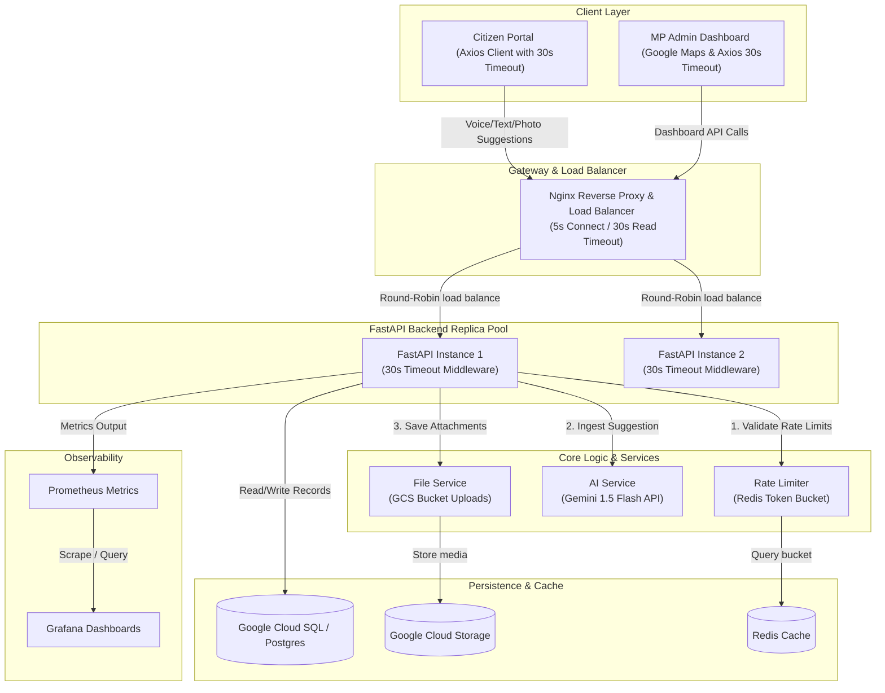

# Civic Pulse - "People's Priorities"
*AI-Powered Constituency Development Planning & Sentiment Mapping Platform*

Civic Pulse is an enterprise-ready, multilingual civic engagement and decision-support platform. It empowers citizens to submit localized infrastructure and community developmental requests via voice recordings, text, or photos, while providing Members of Parliament (MPs) and local administrators with an AI-prioritized mapping dashboard to align funding (e.g., MPLADS) with real-world public demand.

---

## Key Features

* **Multilingual Input Ingestion**: Supports voice recording captures directly from the web client, piping audio requests to an AI Whisper transcription and translation interface.
* **Geographic Sentiment Heatmaps**: Integrates Leaflet GIS coordinate markers color-coded by urgency to visualize demand hotspots in real time.
* **Algorithmic Work Prioritization**: Ranks constituency project proposals using a multi-factor priority index.
* **Local Developer Fallbacks**: Gracefully degrades to local in-memory dictionaries for rate-limiting and SQLite schemas when Redis or PostgreSQL servers are down.
* **Full Prometheus Instrumentor**: Exposes endpoint durations, request speeds, and response logs, pre-configured for Grafana visualization.

---

## System Architecture (MVP Flow)

The following diagram illustrates how the system load balances incoming requests across multiple backend replicas, enforces strict timeouts, uses Google Cloud resources, and serves dashboards:



---

## Phase 1: Architecture & Directory Structure

```
Civic-Pulse/
├── README.md                  # Project overview and run instructions
├── docker-compose.yml         # Dev services (Postgres, Redis, Prometheus, Grafana)
├── backend/                   # FastAPI Python Backend
│   ├── app/
│   │   ├── main.py            # API boot entrypoint, CORS, Static routes, and DB seeding
│   │   ├── core/              # Config settings, logging, and security hashes
│   │   ├── db/                # SQLAlchemy session setup and models (User, Ward, Suggestion, Project)
│   │   ├── api/               # API Router v1 endpoints and Dependency Injection (deps.py)
│   │   ├── services/          # Pure business logic (ai_service, file_service, suggestion_service, project_service)
│   │   └── middleware/        # Redis token-bucket rate limiter
│   └── tests/                 # Integration test suites (Pytest)
└── frontend/                  # Vite + React + TypeScript Frontend
    ├── index.html             # Vite SPA HTML template mounting frame
    ├── nginx.conf             # Production container Nginx SPA router & API proxy reverse rules
    └── src/
        ├── App.tsx            # Auth router and layout wrapper
        ├── styles/            # HSL layout variables, Glassmorphism, and micro-animations
        ├── context/           # Global AuthContext provider
        ├── hooks/             # useAudioRecorder wrapper utilizing Web MediaRecorder API
        ├── components/        # Sidebar structure, MapView, Analytics, and ProjectPrioritizer cards
        └── types/             # Shared TypeScript type signatures
```

---

## Technical Specifications

### The AI Priority Score Algorithm
The prioritization score ($P$) is computed dynamically inside `project_service.py` to evaluate public priority values for wards on a scale of 1 to 100:

\[
P = w_1 \cdot \text{Suggestion Density} + w_2 \cdot \text{Infrastructure Gap Index} + w_3 \cdot \text{Population Deficiency Score}
\]

Where:
* **Suggestion Density** ($w_1 = 0.4$): $\frac{\text{Active unresolved suggestions in Ward}}{\text{Ward Area in sq. km}}$
* **Infrastructure Gap Index** ($w_2 = 0.4$): Multi-sector deficiency score (0-10) pulled from demographic ward indexes.
* **Population Deficiency Score** ($w_3 = 0.2$): Normalized ward size weights to balance representation.

---

## Running the Platform (Phase 1 Local Setup)

### Option A: Running with Docker Compose (Recommended)
This boots up the complete stack, including DB, cache, API services, client panels, and tracking tools:
```bash
docker compose up --build
```
* **Vite React Frontend SPA**: [http://localhost:5173](http://localhost:5173) (Or [http://localhost](http://localhost) Nginx proxy)
* **FastAPI Swagger API Docs**: [http://localhost:8000/docs](http://localhost:8000/docs)
* **Prometheus Metrics Panel**: [http://localhost:9090](http://localhost:9090)
* **Grafana Dashboard Panel**: [http://localhost:3000](http://localhost:3000)

### Option B: Manual Local Setup (Without Docker)

#### 1. Python Environment Setup (Python 3.12)
Ensure you have Python 3.12 installed on your system. Run these commands from the repository root:
```bash
# 1. Create a virtual environment using Python 3.12
python3.12 -m venv venv
source venv/bin/activate

# 2. Install all required dependencies
pip install -r backend/requirements.txt

# 3. Start the FastAPI development server
POSTGRES_PASSWORD="" PYTHONPATH=backend uvicorn app.main:app --reload --port 8001
```
*Note: Automatically falls back to local SQLite (`sqlite:///./civic_pulse.db`) if no PostgreSQL password/host is defined. Set environment variables to enable Google Cloud integrations:*
* `GEMINI_API_KEY`: Set this to your Google AI Studio or Vertex AI Gemini API key to enable active LLM issue translation, classification, and scoring.
* `GCS_BUCKET_NAME`: Set this to your Google Cloud Storage bucket name to upload citizen images and voice clips directly to the cloud.

#### 2. Frontend React Setup
```bash
cd frontend
npm install
npm run dev
```

---

## Standalone Production Deployment Bundle

To package the entire platform (compiled React static build, backend services, Helm charts, and container configuration) into a standalone release:
```bash
./build_deploy_bundle.sh
```
This creates a separate `/deploy-bundle` directory that you can zip and submit. It includes a custom `README_DEPLOY.md` showing how to build and host the app on serverless **Google Cloud Run** and **Cloud SQL**.

---

## Dashboard Authentication Credentials
Administrative features on the MP dashboard are locked behind JWT verification. Seed credentials populated on first boot:
* **Email User**: `admin@civicpulse.gov`
* **Password**: `admin123`

---

## Quality Control & Verification Commands

To maintain code standards, execute these validation commands in your local workspace:

### 1. Python Backend Quality Checks
Run inside the `backend/` directory:
* **Format verification**: `black --check app/ tests/` (Run `black app/ tests/` to auto-format)
* **Style lint check**: `flake8 app/ tests/`
* **Static type verify**: `mypy app/`
* **Execute Test Suite**: `pytest`

### 2. Frontend React + TS Quality Checks
Run inside the `frontend/` directory:
* **Run Unit Tests**: `npm run test` (Vitest engine)
* **TypeScript compile validation**: `npm run typecheck` (tsc validation)
* **Run ESLint checks**: `npm run lint`

---

## Future Phase & Technical Architecture

### 1. Mobile & Offline Extensions
* **Mobile Intake**: Native Flutter or Android apps for offline/field-based issue logging.
* **SMS & Chat Flow**: WhatsApp Business API and SMS gateway integrations for low-connectivity users via Dialogflow.

### 2. Recommended Stack & Tools
* **AI/ML & Generative AI**: Gemini API, Vertex AI agents, and Google AI Studio.
* **Language & Voice**: Cloud Speech-to-Text & Text-to-Speech (multilingual intake), Translation API.
* **Vision & Verification**: Vertex AI Vision & Gemini Multimodal models for validating user photos (e.g. infrastructure faults).
* **Geospatial**: Google Maps Platform (hotspots), Google Earth Engine (satellite imagery).
* **Backend & Storage**: BigQuery (large-scale public data analysis), Firebase (auth/hosting), Cloud Run.
* **Public Datasets**: data.gov.in, Census/NFHS, CPCB air quality, IMD weather datasets.
