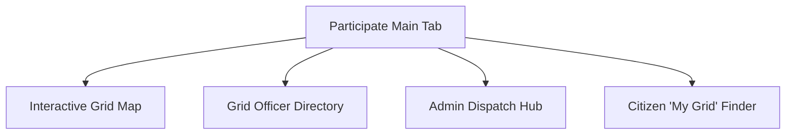

# Implementation Plan: Phase 3 - Grid Governance & Participatory Dashboard ("Participate")

This plan outlines the architecture, database models, API routing, and frontend design required to integrate a Grid Governance and Dispatch dashboard (under a new tab **"Participate"**) as Phase 3 of the Civic Pulse platform.

---

## User Review Required

Please review the proposed design parameters for Grid Governance:
> [!IMPORTANT]
> **Participate Sub-App Placement**: A new navigation tab `/participate` will be added directly after the "Live Map" tab in the portal header.
> 
> **Interactive Grid Overlay**: We will render a multi-color grid layout representing wards or segments on a map.
> 
> **Dispatch Workflows**: Admin users will have a "Dispatch Center" to assign citizen suggestions directly to Grid Officers, changing states in real-time.

---

## Proposed Changes

### 1. Database Schema Extensions (`backend`)

We need a dedicated representation for **Grid Officers** and their relationship to **Wards** (Grids) and **Suggestions**.

#### [NEW] [grid_officer.py](file:///Volumes/DiskD/Civicpulse/Civic-Pulse/backend/app/db/models/grid_officer.py)
Create a `GridOfficer` database model representing the localized official handling reports:
```python
from sqlalchemy import Column, Integer, String, Boolean, ForeignKey
from sqlalchemy.orm import relationship
from app.db.base_class import Base

class GridOfficer(Base):
    __tablename__ = "grid_officers"

    id = Column(Integer, primary_key=True, index=True)
    name = Column(String(100), nullable=False)
    email = Column(String(100), unique=True, nullable=False)
    phone = Column(String(20), nullable=False)
    avatar_url = Column(String(255), nullable=True)
    is_active = Column(Boolean, default=True)
    
    # Associated Ward (Grid)
    ward_id = Column(Integer, ForeignKey("wards.id"), nullable=False)
    ward = relationship("Ward")
```

#### [MODIFY] [suggestion.py](file:///Volumes/DiskD/Civicpulse/Civic-Pulse/backend/app/db/models/suggestion.py)
Add association fields to link a suggestion to an assigned officer and grid:
* `assigned_officer_id`: ForeignKey to `grid_officers.id` (nullable).
* `dispatch_status`: Column `String(50)` (e.g. `Unassigned`, `Dispatched`, `In Progress`, `Resolved`).

---

### 2. API Endpoint Extensions (`backend`)

We will add routing endpoints to fetch grid data, query officers, and trigger dispatches.

#### [NEW] [grid.py](file:///Volumes/DiskD/Civicpulse/Civic-Pulse/backend/app/api/v1/grid.py)
Provide endpoints for:
1. `GET /api/v1/grid/officers` - List all grid officers and their active workloads.
2. `POST /api/v1/grid/dispatch` - Assign a suggestion to an officer.
   * Payload: `{"suggestion_id": int, "officer_id": int}`
   * Updates `suggestion.assigned_officer_id` and shifts status to `"Dispatched"`.
3. `GET /api/v1/grid/my-officer` - Query assigned officer based on geo-coordinates.
   * Query params: `latitude`, `longitude`

---

### 3. Frontend App Additions (`frontend`)

We will build the **Participate** sub-app as a responsive dashboard inside `/participate`.

#### [NEW] [Participate.tsx](file:///Volumes/DiskD/Civicpulse/Civic-Pulse/frontend/src/pages/Participate.tsx)
The main entry point for the Participate sub-app, consisting of four sub-views:



*   **Interactive Grid Map**: Renders Leaflet polygons representing boundary segments (grids). Clicking a grid displays popups showing active reports, the assigned Grid Officer, and a button to view details.
*   **Grid Officer Directory**: Glassmorphic grid layout displaying officers, their photo avatars, contact details, assigned wards, and active workload gauges.
*   **Admin Dispatch Hub (Role Restricted)**:
    *   Lists unassigned citizen complaints with high AI-priority scores.
    *   Dropdown menu to choose an available Grid Officer.
    *   **"Dispatch Action"** button trigger to route the task to the officer in real-time.
*   **Citizen "My Grid" Finder**:
    *   A simple location lookup card using the browser's Geolocation API.
    *   Identifies the user's grid and displays their local officer's contact details, encouraging direct communication.

#### [MODIFY] [TopBar.tsx](file:///Volumes/DiskD/Civicpulse/Civic-Pulse/frontend/src/components/layouts/TopBar.tsx)
Add the Participate navigation link:
```tsx
<NavLink to="/participate" style={navLinkStyle} title={t('nav.participate')}>
  <Users size={16} /> {!isMobile && t('nav.participate')}
</NavLink>
```

#### [MODIFY] [App.tsx](file:///Volumes/DiskD/Civicpulse/Civic-Pulse/frontend/src/App.tsx)
Register the new route:
```tsx
<Route path="/participate" element={<Layout><Participate /></Layout>} />
```

---

## Verification Plan

### Automated Tests
* Create unit tests in `backend/tests/test_grid.py` verifying:
  * Fetching list of grid officers.
  * Successful dispatch updates db entries and sets status code to `200`.
  * Geo-lookup returns the correct officer for specified coordinates.

### Manual Verification
* Run frontend development server.
* Open `http://localhost/participate`.
* Test the user flow:
  1. Click "Locate Me" as a citizen to find the local Grid Officer.
  2. Log in as Admin, go to Participate -> Dispatch Hub, assign an issue, and verify the suggestion updates to "Dispatched" instantly.
